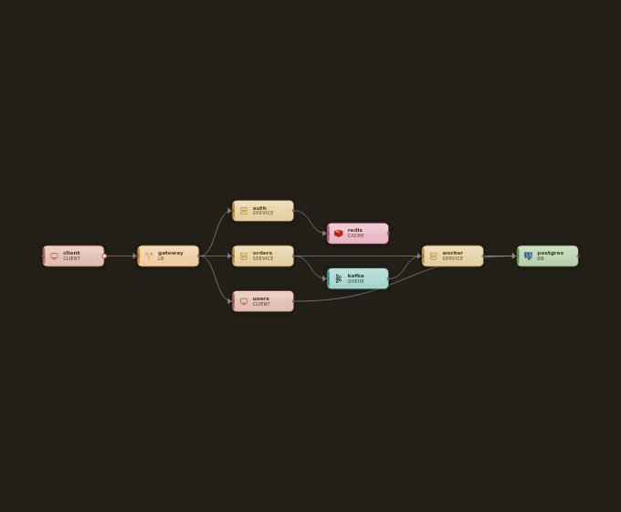
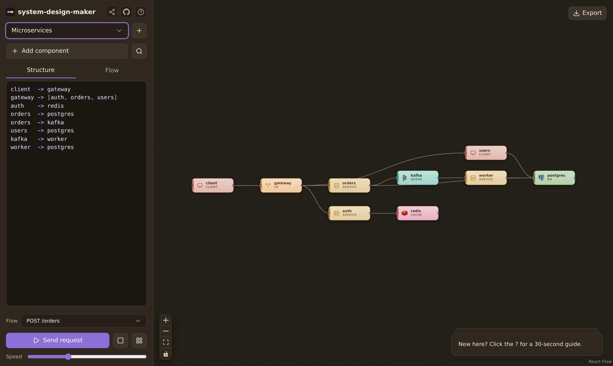
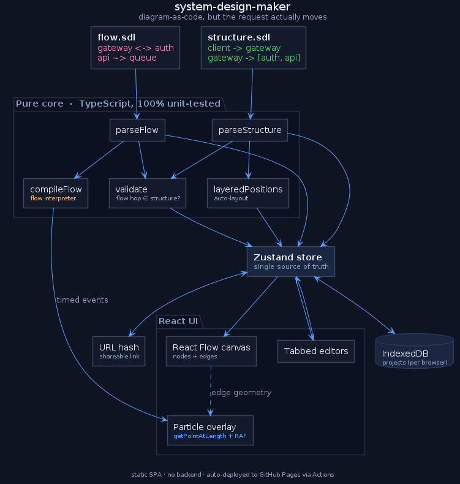

<div align="center">

# system-design-maker

### Diagram-as-code — but the request *actually moves*.

Define a system in two small text files and watch a real request animate through it,
hop by hop, like stepping a debugger across your architecture.

[**▶ Live demo**](https://adssib.github.io/system-design-maker/) &nbsp;·&nbsp;
[Architecture](#architecture) &nbsp;·&nbsp;
[The DSL](#the-dsl) &nbsp;·&nbsp;
[Develop](#develop)

[](https://github.com/adssib/system-design-maker/actions/workflows/deploy.yml)
&nbsp;
&nbsp;

<br/>



<sub>A request animating through the <code>Microservices</code> example — exported straight from the app.</sub>

</div>

---

## Why

Mermaid and D2 draw *static* boxes. Drag-and-drop tools animate a "press play" flow that's just
decoration. Nobody treats **the request lifecycle as a first-class, authored thing**.

system-design-maker splits a system into **two files** — the way engineers actually think:

- **`structure`** — *what the system is.* Components and the connections that are possible.
- **`flow`** — *how one request behaves.* An ordered, timed trace. **Line order = time order.**

The structure renders the diagram. The flow compiles into timed particles that travel the edges —
out-and-back round-trips, fire-and-forget async, the works. Every flow hop is validated against the
structure, so a request that takes an impossible path is a *teaching error*, not a silent lie.



## Features

- **Two-file DSL** — a `structure` and a `flow` file, each with a hand-written parser and cross-file validation.
- **Real-time request animation** — a custom SVG particle layer over [React Flow](https://reactflow.dev) plays one request hop-by-hop.
- **Multiple flows per project** — author several named flows; pick which one plays from a selector.
- **Two-way sync** — edit the diagram and the DSL rewrites itself; edit the DSL and the diagram re-renders. (Add, connect, rename, delete all mirror.)
- **Auto-layout** — [dagre](https://github.com/dagrejs/dagre) spaces nodes and routes edges so nothing overlaps.
- **Export** — save the diagram as a **PNG** or the animated flow as a **GIF**, straight from the canvas.
- **Component catalog** — branded icons (Redis, Postgres, Kafka, NGINX, Docker, Kubernetes…) via [devicon](https://devicon.dev), with a Lucide fallback; searchable add-component palette.
- **Command palette** — `⌘/Ctrl-K` to run actions, add components, or jump to a node.
- **Syntax highlighting** in both editors, starter examples, an in-app guide, and **shareable URLs**.
- **Local-first & responsive** — IndexedDB persistence, multi-project, no backend; works on mobile.

## The DSL

**structure** — type is inferred from the name (or annotate it `name : type`):

```
client  -> gateway
gateway -> [auth, api]
api     -> [cache, db]
api     -> queue
queue   -> worker
worker  -> db
```

**flow** — one or more named flows, each an ordered trace (top to bottom):

```
flow "GET /profile":
  client  -> gateway
  gateway <-> auth      # round-trip: out, then back
  gateway -> api
  api     <-> db        # fetch
  api     ~> queue      # async, fire-and-forget (doesn't block)

flow "POST /order":
  client  -> gateway
  gateway -> api
  api     ~> queue
```

| verb | meaning | clock |
|------|---------|-------|
| `->`  | one-way call           | advances |
| `<->` | call **and** response  | advances by both legs |
| `~>`  | async / fire-and-forget| does **not** advance |
| `(label)` | rides the particle as a tag (`hit`, `miss`, `429`…) | — |

## Architecture

A pure, fully unit-tested core (parsers, validator, layout, flow interpreter) feeds a single
Zustand store. React Flow draws the graph; a custom SVG overlay animates the request on top.



<sub>Diagram is authored as PlantUML — see [`docs/architecture.puml`](docs/architecture.puml).</sub>

## Storage (no backend, on purpose)

Everything is a static SPA. Your projects live in the **browser's IndexedDB** — they survive a
refresh, support multiple projects, and never touch a server. Storage is per-browser/per-device;
sharing happens through a **URL hash** that encodes both files, not a shared database.

## Develop

```bash
npm install
npm run dev      # local dev server
npm test         # Vitest unit suite (parsers, interpreter, store, storage, share)
npm run build    # type-check + static build to dist/
```

## Deploy

Pushes to `main` auto-deploy to **GitHub Pages** via GitHub Actions
([`.github/workflows/deploy.yml`](.github/workflows/deploy.yml): install → test → build → publish).
The Vite `base` is `/system-design-maker/` for the project-page subpath; change it in
`vite.config.ts` for a different repo name, a user page, or a custom domain. Because the output is
just static files, `dist/` also drops onto Netlify, Cloudflare Pages, or Vercel unchanged.

## Tech

React · Vite · TypeScript (strict) · [@xyflow/react](https://reactflow.dev) · Zustand · Tailwind + shadcn/ui · dagre · idb-keyval · Vitest
